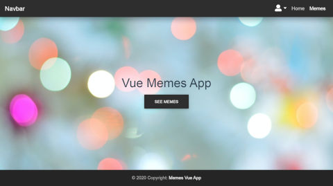

<!-- PROJECT LOGO -->
<br />
<p align="center">
  <a href="https://github.com/mateuszlubianka1993/memes-vue">
    
  </a>

  <h3 align="center">The Memes App Vue</h3>

  <p align="center">
    Memes App
    <br />
    <br />
    <a href="https://memes-vue.netlify.app/">View Demo</a>
  </p>
</p>


<!-- TABLE OF CONTENTS -->
## Table of Contents

* [About the Project](#about-the-project)
  * [Built With](#built-with)
* [Usage](#usage)
* [Screens](#screens)
* [Getting Started](#getting-started)
  * [Prerequisites](#prerequisites)
  * [Installation](#installation)
* [Contact](#contact)


<!-- ABOUT THE PROJECT -->
## About The Project

This is the Memes App. You can sign up, sign in and log out. If you are logged in, you can also add your memes. Visiting the 'Profile' page, you can view information about the logged in user.
**Scroll down to get more info**

### Built With

* Vue.js
* Vuex
* Firebase
* Html
* CSS
* Java Script
* axios
* vue-router
* MDBVue
* SCSS

## Usage


## Screens



<!-- GETTING STARTED -->
## Getting Started

To get a local copy up and running follow these simple steps.

### Prerequisites

This is an example of how to list things you need to use the software and how to install them.
* npm
```sh
npm install npm@latest -g
```

### Installation
 
1. Clone the repo
```sh
git clone https://github.com/mateuszlubianka1993/memes-vue
```
2. Install NPM packages
```sh
npm install
```
3. Compiles and hot-reloads for development
```sh
npm run serve
```
4. Compiles and minifies for production
```sh
npm run build
```
5. Lints and fixes files
```sh
npm run lint
```


<!-- CONTACT -->
## Contact

* Project Link: [https://github.com/mateuszlubianka1993/memes-vue](https://github.com/mateuszlubianka1993/memes-vue)
* Live Demo: [https://memes-vue.netlify.app//](https://memes-vue.netlify.app//)
