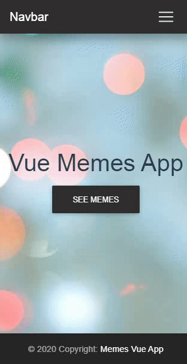
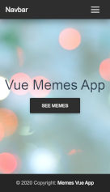

<!-- PROJECT LOGO -->
<br />
<p align="center">
  <a href="https://github.com/mateuszlubianka1993/movie-vue">
    
  </a>

  <h3 align="center">Movir App Vue</h3>

  <p align="center">
    Simple Movie App.
    <br />
    <br />
    <a href="https://movie-vue.netlify.app">View Demo</a>
  </p>
</p>


<!-- TABLE OF CONTENTS -->
## Table of Contents

* [About the Project](#about-the-project)
  * [Built With](#built-with)
* [Usage](#usage)
* [Screens](#screens)
* [Getting Started](#getting-started)
  * [Prerequisites](#prerequisites)
  * [Installation](#installation)
* [Contact](#contact)


<!-- ABOUT THE PROJECT -->
## About The Project

This is the Movie App. On home page you can find 3 lists: Popular Movies, Popular People and Popular TV Shows. After click on a movie/person/show card you can see page with more details.
You can also find the movie ranking and the tv shows ranking. 
In this application it is also possible to find out what films are currently in theaters or about upcoming film premieres.  
You can also search for movies/people/tv shows by title/name.
**Scroll down to get more info**

### Built With

* Vue.js
* Html
* CSS
* Java Script
* axios
* vue-router
* MDBVue
* The Movie Database API
* SCSS

## Usage


## Screens




<!-- GETTING STARTED -->
## Getting Started

To get a local copy up and running follow these simple steps.

### Prerequisites

This is an example of how to list things you need to use the software and how to install them.
* npm
```sh
npm install npm@latest -g
```

### Installation
 
1. Clone the repo
```sh
git clone https://github.com/mateuszlubianka1993/movie-vue
```
2. Install NPM packages
```sh
npm install
```
3. Compiles and hot-reloads for development
```sh
npm run serve
```
4. Compiles and minifies for production
```sh
npm run build
```
5. Lints and fixes files
```sh
npm run lint
```


<!-- CONTACT -->
## Contact

* Project Link: [https://github.com/mateuszlubianka1993/movie-vue](https://github.com/mateuszlubianka1993/movie-vue)
* Live Demo: [https://movie-vue.netlify.app/](https://movie-vue.netlify.app/)
